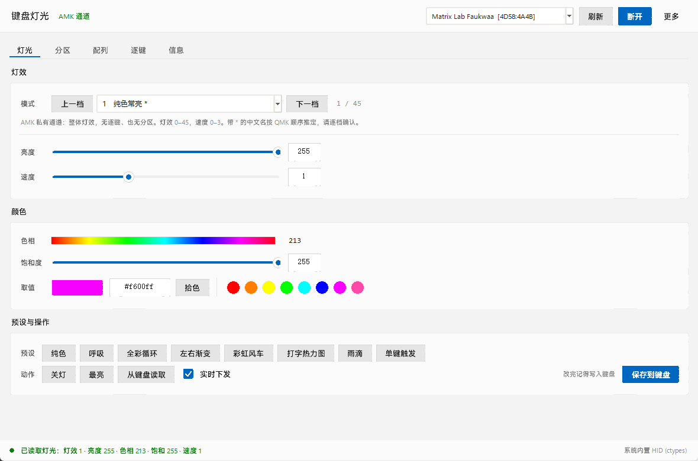
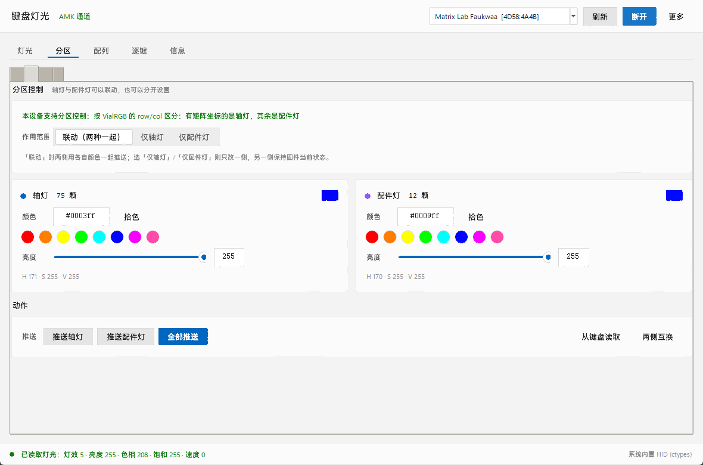

# vial-matrix-light

Matrix 键盘（Matrix Lab / Faukwaa 等）与各类 Vial 键盘的**灯光调整软件**。
Python + Tkinter 桌面程序，通过 USB raw HID 直接和键盘通信，实时改灯、可保存。

界面是 **Windows 11 风格（Mica 浅色）**：浅灰底 + 分层圆角卡片 + 天蓝强调色 +
Segoe UI Variable 字体。控件（按钮 / 滑块 / 分段 / 复选 / 页签）全部自绘，
没有用 ttk 的默认外观。



---

## 1. 支持范围

软件会在连接后**自动探测**固件暴露的照明通道，三种都实现了：

| 后端 | 典型设备 | 能做什么 | 逐键控制 | 分区控制 |
|---|---|---|---|---|
| `amk` | **Matrix 官方固件**（Faukwaa 实测）、AMK 系固件 | 轴灯 + 配件灯 + 指示灯 + 点阵屏，各自灯效 / 亮度 / 速度 / 颜色 | ✗ | ✓ 轴灯/配件灯**独立设灯效** |
| `vialrgb` | 副厂 Vial 固件、支持 VialRGB 的板子 | 灯效 / 亮度 / 速度 / 颜色 | ✓ 可逐键直接上色 | ✓ 轴灯/配件灯可分开 |
| `via` | 只实现 VIA 标准照明通道的老固件 | 灯效 / 亮度 / 速度 / 颜色 | ✗ | ✗ |

> **关于「配件灯」**：**两种后端都能分开控制**，但机制完全不同。
>
> * `vialrgb`：靠 LED 的 `row`/`col` 区分（有矩阵坐标 = 轴灯，`0xFF` = 配件灯），
>   只能逐灯推颜色，**不能给两组分别设灯效**。
> * `amk`：Matrix 官方固件在标准 Vial 的 `0x07/0x08` 之外，另有一整套
>   **`0xFD` 前缀的扩展协议**（同样是 32 字节 raw HID 报文，共用同一通道）。
>   固件里有**四个互相独立的灯光类型**：
>
>   ```python
>   RGB_TYPE_MATRIX    = 0   # 轴灯
>   RGB_TYPE_STRIP     = 1   # 配件灯（灯条）
>   RGB_TYPE_INDICATOR = 2   # 指示灯
>   RGB_TYPE_GRID      = 3   # 点阵屏
>   ```
>
>   这就是「配件灯跟着轴灯一起亮，但**有独立灯效**」的由来 —— 两者在固件里
>   是两套互不干扰的状态，只是被打到同一个 LED 数组上。Faukwaa 实测有
>   **5 条配件灯条、共 18 颗灯**，每条还能各选 9 档灯效。
>
> 协议细节见第 4 节；这些结论的依据是 Matrix 官方配置页的 Python 源码明文
> （已提取到 `reference/matrix-vialweb/`）。

探测顺序与依据（都是实测确认过的）：

1. 读 Vial 协议 `0xFE 0x00` 返回的第 13 个字节（`msg[12]`）。固件若编译了
   `VIALRGB_ENABLE` 该字节为 `1` —— 这是权威标志，为 1 才走 VialRGB。
2. 否则探测 AMK 标准照明 value id（`0x80`–`0x83`），任一非零即判定为 AMK
   通道；接着再探一次 `0xFD 0x00`（AMK 扩展协议版本），成功则说明配件灯
   / 点阵屏也走这条通道。
3. 再退回 VIA 标准照明通道（`0x09`–`0x0C`）。

> Faukwaa 官方固件的实例：VIA 协议 9 / Vial 协议 6 / `vialrgb_flag = 0`，
> 键盘定义里 `"lighting": "amk_rgblight"` —— 所以它既不是 VialRGB 也不是
> VIA 标准通道，而是 AMK 通道。AMK 扩展协议版本实测为 **1**。
> 这正是本工具存在的理由。

---

## 2. 快速开始

**Windows 上零依赖即可运行**（内置 ctypes 版 HID 后端）：

```bat
双击 run.bat
```

或者：

```bat
python main.py
```

要求：Python 3.6+，且该 Python 带 `tkinter`。`run.bat` 会按
`py -3` → `python` → 常见安装目录 的顺序自动挑选可用解释器。

> **run.bat 的排错设计**：启动过程中的所有输出（stdout + stderr）都会写进
> `run.log`，退出码非 0 时会直接把日志打印在窗口里并 `pause`。
> 所以万一还是起不来，看 `run.bat` 同目录的 `run.log` 就能定位原因。

**可选**：想要更标准的底层，可以装官方 hidapi（装不装功能一样）：

```bat
install.bat
:: 或
python -m pip install --user hidapi
```

> 你机器上的 `C:\Program Files\Python36\python.exe` 自带 tkinter（Tk 8.6），
> 直接 `run.bat` 就能起来。若用 Microsoft Store 版 Python，请改装 python.org 版。

---

## 3. 界面功能

五个页签：**灯光 / 分区 / 配列 / 逐键 / 信息**。

### 灯光
- **灯效**：下拉列表，或用「上一档 / 下一档」逐档步进。
  - AMK：固件没有「读取灯效列表」也没有「翻译名称」的接口，所以 1–45 档
    里除了少数能确认的（如 1 = 静态纯色）之外，**只显示「模式 N」** ——
    宁可选一个中性的编号让你自己试，也不给一个看着像样但错误的名字。
  - VialRGB：0–44，用官方 `VIALRGB_EFFECTS` 表映射中英文名。
- **亮度 / 速度**：Win11 风格的自绘滑块 + 数字框，拖动即下发（可关掉「实时下发」）。
  - AMK：亮度 0–255，速度 0–3（实测超过 3 会被固件夹回）
  - VialRGB：亮度 0–255，速度 0–255
- **颜色**：可点色相条、用拾色器、填 `#rrggbb`，或点 8 个快捷色圆点。
- **预设**：纯色 / 呼吸 / 全彩循环 / 左右渐变 / 彩虹风车 / 打字热力图 /
  雨滴 / 单键触发。预设编号按后端分别映射（AMK 没有独立的「呼吸 / 彩虹」
  轴灯档位，选到时会提示该后端无对应档）。
- **动作**：关灯、最亮、从键盘读取、保存到键盘。

> 这一页管的是**轴灯**。配件灯在 AMK 固件里是另一套独立状态，
> 到「分区」页给它单独选灯效和颜色。



### 分区（轴灯 / 配件灯分开或联动）
把「轴灯（键位灯）」和「配件灯（灯条 / 底灯 / 氛围灯）」当成两组独立对象：

- **作用范围**：联动（两种一起）/ 仅轴灯 / 仅配件灯。
- 两组各有一个**颜色 + 亮度**设置卡，可以配成不一样的色（比如轴灯蓝、底灯紫）。
- **推送轴灯 / 推送配件灯 / 全部推送**、**两侧互换**、**从键盘读取**
  （从「逐键」页当前配色反推两侧代表色）。
- **配件灯条栏**（仅 `amk` 后端显示）：挑一条灯条（Faukwaa 有 5 条），
  给它单独选 0–9 档灯效，可「应用到该灯条」或「全部灯条同步」；
  下面还有**亮度**（0–255）与**速度**（0–15）两个滑块。
  - 选中的档位不是「自定义」时，栏里会给出黄色提示，说明这一档由固件自己
    渲染、软件改不动它的颜色/亮度/速度。
  - 点「推送配件灯」时会**自动把灯条切到「自定义」档**，这样你选的颜色才
    真的会显示出来（本机固件只有这一档吃逐灯自选色）。
  右侧实时显示这条灯条有几颗亮着、是不是卡在同一个颜色上。
- 未选中配件灯侧时，灯条栏整体置灰（灰底灰字、下拉变 disabled），
  一眼看出现在改不动它。

**两种后端的可用性判据不同**：

- `vialrgb`：`GET_LED_INFO` 返回的 `row`/`col` 有效 → 轴灯，`0xFF` → 配件灯。
  两组都有 LED 才认为支持分区。分组推送走 `DIRECT_FASTSET`，同一包里
  LED 索引连续就能从任意位置起推，所以只推一侧时不会碰另一侧。
- `amk`：直接问固件要配件灯条表（`0xFD 0x1B/0x1C`），能读到就支持。
  Faukwaa 实测 **5 条共 18 颗**（索引 75–92，紧接在 74 颗轴灯之后）。
  推送分两路：轴灯走标准 `0x83` **整组**写色（没有逐灯接口），配件灯走
  `0xFD 0x1E` **逐灯**写色。因此「仅轴灯」时配件灯完全不动 ——
  这正是原厂那种「两组各有各的灯效」的行为。
- 都不支持时**整页置灰**，点击任一入口都会在日志里给出**具体原因**，
  而不是静默无反应。

> **AMK 后端没有逐灯坐标**。分区页概览里轴灯是按矩阵 `rows × cols` 平铺的
> **逻辑灯位**，配件灯每条占一列排在右侧；这仅用于概览，不用于逐键上色
> （实现见 `VialDevice.amk_leds()`，真实全局灯号存在 `led.global_index`）。


### 配列
从键盘**内嵌的 Vial 定义**（XZ 压缩的 `vial.json`，`0xFE 0x01/0x02` 读出并解压）
解析配列，按当前灯光颜色实时着色（圆角块）。两种视图：
- **矩阵网格**（默认）：每个格子是一个矩阵单元 `行,列`，由真实的
  `matrix.rows × matrix.cols` 生成，不读定义里的坐标 —— **这种视图是准确的**，
  任何键盘都成立。**要对照实物排查灯光，用这个。**
- **物理配列**：按 KLE 规则还原几何，**旋转（`r` / `rx` / `ry`）已按规范实现**
  —— 字母区的 12° 斜置会正确画出来（旋转的键用多边形绘制，外接框按旋转后
  角点计算）。

#### 物理配列为什么还是和 matrix-lab 官网对不上

Faukwaa 的 `layouts.keymap` **不是一份连续的 KLE 定义**，而是被拆成 20 个区块，
且**前后两半用的是互不兼容的坐标系**（实测：两半的矩阵坐标交集为 0）：

| 区块 | 内容 | 坐标基准 | 外接框 |
|---|---|---|---|
| 0–7 | 左外侧列（Esc/Tab/Caps/LShift/LCtrl）+ 右外侧列（Bksp/Enter/导航） | **平铺**，`x` 从 0.5 排到 26.75 | 26.25 × 5.50 U |
| 8–19 | 两片 Alice 字母区（各 12° 反斜） | **绕 `rx=8.5` 旋转**，`x` 是负偏移 | 走到 `x=-3.51` |

两块叠在一起就是 `30.26 × 10.71 U` —— 比真实键盘（约 21 × 6U）宽出近 10U、
高出近 5U，视觉上就是「左右两块各自飞出去」。**不是旋转没实现，是这两半需要
跨区块缝合**（要按矩阵列序重新拼：`左外侧列 → 左翼 → 右翼 → 右外侧列`）。

#### 另外两个必须处理的定义细节

1. **`layouts.labels` 是布局选项**，Faukwaa 有 4 项：
   `['Stepped Caps Lock', ['Left Space','2.25U','2.75U'], ['Right Space','2.75U','2.25U'], 'Split Backspace']`
   → 选项数 `[2, 3, 3, 2]`。键位串里的 `\n\n\n` 是选项变体
   （如 `0,10\n\n\n3,0` / `0,10\n\n\n3,1` 是 Split Backspace 的两个位置）。
   渲染时只取**主位置**，变体不参与几何 —— 否则同一格会叠出两个方块。
2. **`ry` 会重置 `y`**。KLE 规范里 `rx` 重置 `x`、`ry` 重置 `y`。
   把 `ry` 当普通累加值（旧实现）会让旋转区块一路往下掉：
   实测外接框从 **17.61U 高**降到 **10.71U 高**。
   同理**每个顶层数组行首必须重置 `x`**，否则键盘会被拉成 30U 长条。

### 逐键（需要 VialRGB 固件）
- 按每颗 LED 的 `(x, y)` 坐标自动排布成键盘图：细边是轴灯，亮蓝边是配件灯。
- 工具：**画笔**（拖动上色）/ **取色** / **填充**（整盘同色）。
- 图案：水平渐变 / 垂直渐变 / 彩虹 / 波浪 / 全部同色 / 清空。
- **本地动画**：由电脑以约 30fps 持续推送 fastset，实现固件本身没有的动态效果。
- 推送前会自动把灯效切到 `Direct`。FASTSET 每包最多 9 颗 LED，自动分包。

### 信息
左栏是设备信息（VID/PID、UID、协议版本、`amk_rgb_matrix`、`indicator`、
分区 LED 数、探测过程、固件支持的灯效列表），右栏是带颜色分级的日志。
左下角有一个**原始报文调试台**：输入十六进制直接发 32 字节报文并查看响应。
这个台子就是本项目逆向 AMK 协议时用的工具。

> 键盘定义偶发读取失败（分页读 + XZ 解压，设备刚被别的程序占用过时会出现）
> **不会**让「信息」页整体失败 —— 只是那几行显示为空，并在下面标出
> `⚠ 键盘定义读取失败`。VID/PID/协议版本/探测过程照常显示。

---

## 4. 协议细节（实测）

### 通用
- HID 接口：`usage_page = 0xFF60`，`usage = 0x61`
- Vial 固件的序列号固定为 `vial:f64c2b3c`
- 报文固定 32 字节；Windows 下写入需前置 1 字节 report ID `0x00`（共 33）

### AMK 标准照明通道（Matrix 官方固件）
读 `[0x08, value_id]`，写 `[0x07, value_id, ...]`。

这四个 `value_id` 是 **QMK `via_lighting_value` 的标准编号**
（见 `quantum/via.h`），不是厂商私有 —— 只不过 Matrix 固件把它们
接到了自己的 rgb_matrix 上，**只管轴灯这一路**：

| value_id | QMK 名称 | 含义 | 范围 | 写包 |
|---|---|---|---|---|
| `0x80` | `id_qmk_rgblight_brightness` | 亮度 | 0–255（原值直写） | `07 80 v` |
| `0x81` | `id_qmk_rgblight_effect` | 灯效模式 | **1–45**（写 0 会被固件改成 1；>45 被夹到 45） | `07 81 m` |
| `0x82` | `id_qmk_rgblight_effect_speed` | 速度 | 0–3（超出被夹到 2） | `07 82 s` |
| `0x83` | `id_qmk_rgblight_color` | 色相 + 饱和度 | 各 0–255，按发送顺序存 | `07 83 h s` |

响应从第 3 字节开始是数据，例如 `08 83 D0 FF` = 色相 `0xD0`、饱和 `0xFF`。
`0x84–0x8B` 无隐藏字段；固件未编译 `QMK_SETTINGS`（`0xFE 0x09` 全 `0xFF`）。
保存命令 `0x09` 会被原样回显（AMK 通常是即改即存，可忽略）。

> **固件怪癖：`0x81` 不接受 0。** 写 `0` 再回读得到 `1`。也就是说在 Faukwaa
> 官方固件上**无法通过 `0x81` 把轴灯关掉**，最小只能是编号 1。这是逐值写入 →
> 回读实验测出来的（写 `1/43/5/44/45` 都原样回读，写 `46` 被夹到 `45`，只有 `0`
> 会被静默改成 `1`）。想关灯请用 `0x80` 把亮度调到 `0`。
>
> 灯效 1–45 是 Matrix 自移植的 rgb_matrix 表，固件**没有**「翻译名称」的命令，
> 所以本软件对绝大多数档位只显示「模式 N」而不是编一个看着像样但错误的名字。

### AMK `0xFD` 扩展协议（轴灯 / 配件灯 / 指示灯 / 点阵屏）

> **这是本项目的核心发现。** 第五轮我曾断言「固件里没有配件灯这个可独立
> 寻址的对象」，那是**错的** —— 根因是我只扫了标准 Vial 的 `0x00`–`0xFF`
> value_id，而配件灯在 `0xFD` 前缀的**独立命令空间**里，两者不共享编号。
> 真相来自 Matrix 官方配置页的 Python 源码明文（`reference/matrix-vialweb/amk/protocol.py`）。

**传输层与标准 Vial 完全一致**：同样 32 字节 raw HID 报文、同一个
`usage_page 0xFF60 / usage 0x61` 接口、同样的「写前置 1 字节 report ID」。
`reference/matrix-vialweb/util.py` 里的 `hid_send()` 就是同一份代码。

响应布局统一为：

```
[0] = 0xFD           前缀
[1] = cmd            回显命令号
[2] = OK(0xAA) | 失败码
[3..] = 载荷
```

命令表（实测确认，编号取自 `amk/protocol.py`）：

| 命令 | 值 | 说明 |
|---|---|---|
| `AMK_PROTOCOL_GET_VERSION` | 0 | 返回协议版本；Faukwaa 实测 **1** |
| `GET_RGB_STRIP_COUNT` | 27 | 配件灯条组数 |
| `GET_RGB_STRIP_INFO` | 28 | 单条灯条的结构 |
| `GET_RGB_STRIP_LED` | 29 | 读一颗配件灯 |
| `SET_RGB_STRIP_LED` | 30 | 写一颗配件灯 |
| `GET/SET_RGB_STRIP_MODE` | 31 / 32 | 读 / 写灯条整体灯效 |
| `GET/SET_RGB_INDICATOR_LED` | 33 / 34 | 指示灯（CapsLock 等） |
| `GET_RGB_MATRIX_INFO` / `ROW_INFO` | 43 / 44 | 轴灯信息 |
| `GET/SET_RGB_MATRIX_MODE` | 45 / 46 | 轴灯灯效 |
| `GET/SET_RGB_MATRIX_LED` | 47 / 48 | 轴灯逐灯 |
| `GET_RGB_DATA` / `GET_RGB_PARAM` / `SET_RGB_PARAM` | 60 / 61 / 62 | 灯区参数 |
| `GET/SET_RGB_GRID_*` | 65–70 | 点阵屏 |

**Faukwaa 配件灯实测模型**（5 条灯条，共 18 颗灯）：

| 灯条 | config | start | count |
|---|---|---|---|
| #1 | 1 | 75 | 4 |
| #2 | 2 | 79 | 4 |
| #3 | 3 | 83 | 4 |
| #4 | 4 | 87 | 4 |
| #5 | 5 | 91 | 2 |
| 轴灯 | — | 0 | 74 |

配件灯紧接轴灯之后（索引 **75–92**），全局灯数组共 **93 颗**（0–92）。
注意 `vial.json` 里的 `amk_rgb_matrix` **只写了轴灯**（`start:0 count:74`），
配件灯完全由 `0xFD` 协议动态读取 —— 只看键盘定义是永远发现不了它们的。

**读灯条结构的真实偏移**（我一开始读错了，这里记下来）：

```
GET_RGB_STRIP_INFO(28, index) 响应：
  [3] = index   灯条编号
  [4] = 第几条（1 起，**不是 config**）
  [5] = start   起始灯号（1 字节）
  [6] = count   灯数

GET_RGB_STRIP_MODE(31, index) 响应：
  [4] = mode    当前灯效
```

> **`GET_STRIP_INFO` 不返回 mode**，必须另用 `GET_STRIP_MODE` 读。
> 我最初以为 `[7]` 是 mode，结果回读永远是 0，误判成「SET 没生效」；
> 其实 `SET_STRIP_MODE` 一直是好的（写 2 → 回读 2）。
>
> 另外：官方 Web 配置里的 start/count 是从**键盘定义的
> `amkFeature.rgb_strip.strips`** 读的，压根不调 `GET_STRIP_INFO`。
> 本机 Faukwaa 的定义（2968 字节）里**没有 `amkFeature` 这一段**
> （只有 `name/vendorId/productId/keyboardType/keyboardSpeed/lighting/
> amk_rgb_matrix/indicator/matrix/layouts`），所以必须走这条命令 ——
> 实测能正确读出 5 条灯条。**不是**官方源码读错了。

**配件灯灯效表（第三套独立编号体系，来源 `amk/rgb.py` 的 `RL_EFFECT_*`）**：

| 值 | 名称 | 中文 |
|---|---|---|
| 0 | Custom | 自定义（逐灯上色）**← 唯一能吃下自选颜色/亮度的档** |
| 1 | Gradient | 渐变 |
| 2 | Static | 静态 |
| 3 | Blink | 闪烁 |
| 4 | Rainbow | 彩虹 |
| 5 | Random | 随机 |
| 6 | Breath | 呼吸 |
| 7 | Wipe / Scan | 擦除 / 扫描（官方定义两者共用编号） |
| 8 | Circle | 环绕 |
| 9 | （固件专有） | 本机多出的一档 |

> **⚠️ 本机灯效编号是 0–9 共 10 档，不是 0–8。**
> 真机实测：`SET_RGB_STRIP_MODE` 对**任意**值都回 `0xAA`，但读回会被
> **对 10 取模** —— 写 10 读回 0、写 11 读回 1、写 255 读回 5。
> 官方源码的名字表来自键盘定义的 `amkFeature`（本机没有），
> 所以**编号对应的实际效果顺序不保证与官方一致**，上表仅作参考。
>
> **三套灯效编号体系互不相同，绝不能混用**：
> `QMK_RGBLIGHT_EFFECTS`（VIA 标准 `0x0A`，0–36）、
> `VIALRGB_EFFECTS`（VialRGB，0–44）、
> `RL_EFFECT_*`（AMK 配件灯，0–9）。同一个数字在三套表里是完全不同的效果。
> `vial_light/effects.py` 把它们严格分开，之前把 AMK 轴灯按 VialRGB 编号
> 取名是错的，现已改为保守显示「模式 N」。

**逐灯字段结构**（`AmkStripLed`）：响应 `[3]=index [4]=hue [5]=sat [6]=val [7]=param`。
`param` 是**位域**，不是亮度：

```
bit 0     on
bit 1     dynamic
bit 2     blink
bit 3     breath
bit 4-7   speed (0-15)
```

**只写了自定义档才生效 —— 这是本轮最重要的结论**：

固件渲染配件灯有两条路，而**本机只实现了其中一条**：

| 灯效档 | 颜色 / 亮度 / 速度从哪来 | 本机可用？ |
|---|---|---|
| `Custom`（0） | **逐灯** `SET_RGB_STRIP_LED(30)` 的 HSV / param 位域 | ✅ 可以 |
| 非 Custom（1–9） | 固件按自己的算法渲染；颜色本该走灯条级 `RGB_PARAM_COLOR/BRIGHT/SPEED` | ❌ **本机走不通** |

官方 Web 配置在非 Custom 档下会调
`apply_rgb_param(RGB_TYPE_STRIP, RGB_PARAM_COLOR, ...)`，但本机固件
**根本没实现这条通道**（见下面的命令支持表），所以官方那条路在这把键盘上
**同样无效** —— 这是固件差异，不是调用姿势问题。

**实测的 0xFD 命令支持表**（逐条扫 0..70，只看 `[2] == 0xAA`）：

| 区间 | 结果 |
|---|---|
| `0` | ✅ 版本 = 1 |
| `7–14` | ✅ 实现（用途未考） |
| `27`–`34` | ✅ STRIP + INDICATOR 全族 |
| `43`–`48` | ✅ MATRIX 全族（`43` 回 start=0,count=74；`45` 回当前轴灯灯效） |
| `60` / `61` / `62` | ❌ **`0x55`**（`GET_RGB_DATA` / `GET_RGB_PARAM` / `SET_RGB_PARAM`） |
| `65`–`68` | ❌ `0x55`（点阵屏 GRID 未实现） |
| 其余 | ❌ `0x55` |

**几个坑（全部实测）**：

- **`SET_RGB_PARAM`(62) 一律回 `0x55`（失败）**，不分 `rgb_type`、不分
  `param`，响应还把请求原样回显。固件拒绝整条参数写入，所以
  **颜色 / 亮度必须走逐灯写**（`set_strip_color()` 就是逐颗循环读改写）。
- **`GET_RGB_PARAM`(61) / `GET_RGB_DATA`(60) 也是 `0x55`** —— 本机
  **没有**「读活动渲染色」的能力，所以软件无法自动判断某个灯效有没有在动，
  只能靠肉眼。
- **配件灯亮度**：本机唯一办法是把亮度写进每颗灯的 **HSV 的 V 分量**
  （`strips-bright <0-255>`）。`val == 0` 就等于关灯。
- `GET_STRIP_LED`(29) 用 **1 字节** index（协议 v1）；v2 才是 2 字节小端。
- **轴灯关不掉**：`0x81 = 0` 会被固件改成 1，`MATRIX_MODE(46) = 0`
  也会被改成 1，`0x80`（亮度）是**只读 255、写被忽略**。
  也就是说 `RGB_TOG` 这类固件级开关**软件无法镜像、也干扰不到**。
- 指示灯 `caps_lock` / `num_lock` / `scroll_lock` 当前全为 `param=0x00`（未启用）。
- **出厂状态下 5 条灯条里有 4 条是暗的**：实测 strip 1–4 的灯
  `param=0x80`（on 位 = 0）、`val=0`，只有 strip 0 亮着。
  这不是故障，是出厂默认。想让 18 颗全亮，跑一次
  `mvl.py strips-color --hsv 0,255,255 --force` 即可。


保存：`mvl.py strips-read --json FILE` 会把 18 颗的 HSV+param 全量导出，
`strips-restore FILE` 原样写回。出厂快照也放在
`reference/strip_backup_faukwaa.json`。

### VialRGB 官方协议
`0x40` GET_INFO、`0x41` GET/SET_MODE、`0x42` GET_SUPPORTED / DIRECT_FASTSET、
`0x43` GET_NUMBER_LEDS、`0x44` GET_LED_INFO。
FASTSET 负载：`07 42 <首颗LED:u16 LE> <数量:u8> (<h><s><v>)×数量`，单包最多 9 颗。

### 键盘定义
`0xFE 0x01` 取长度，`0xFE 0x02 <page:u16 LE>` 每页 32 字节；整体是
**XZ 压缩**的 JSON（首字节 `0xFD`，魔数 `7zXZ`）。Faukwaa 上是 904 字节。

定义里 `layouts` 的两个字段都要读：
- `layouts.labels`：**布局选项**列表。字符串 = 2 选项；数组 = `len()` 个选项。
  Faukwaa 是 `['Stepped Caps Lock', ['Left Space','2.25U','2.75U'],
  ['Right Space','2.75U','2.25U'], 'Split Backspace']` → `[2, 3, 3, 2]`。
- `layouts.keymap`：KLE 坐标 + 键位串。键位串用 `\n\n\n` 分隔**选项变体**，
  第一段是默认位置。渲染只取默认位置，变体不参与几何。

同一份定义里的 20 个区块可能**混用多个坐标系**（平铺 + 旋转），
所以「按 KLE 逐块累加」得到的几何不一定能直接拼成实物。
解析完务必量外接框自查：正常客制化键盘约 **15–21U 宽、5–7U 高**；
超出就说明还没对齐，此时应在界面上说明原因并引导用户用矩阵网格视图。

---

## 5. 命令行

图形界面不方便时（或想脚本化）用 `mvl.py`：

```bat
python mvl.py list                    :: 列出 Vial 设备
python mvl.py info                    :: 设备信息 + 探测过程
python mvl.py get                     :: 读当前灯光
python mvl.py set --effect 5 --val 200
python mvl.py set --hue 213 --sat 255 --save
python mvl.py color --hex "#ff5500"
python mvl.py preset 呼吸
python mvl.py effects                 :: 列出可选灯效
python mvl.py off / on
python mvl.py raw "08 83"             :: 发原始报文看响应
python mvl.py def --save my.vial.json :: 导出键盘定义
python mvl.py write-test 0x81 5       :: 写 value_id 再回读（自带还原）
```

**配件灯专用子命令**（AMK `0xFD` 协议，全部真机验证过）：

```bat
python mvl.py strips                       :: 列出 5 条灯条 + 10 档灯效编号表
python mvl.py strips-read                  :: 逐颗读数
python mvl.py strips-read --json bk.json   :: 逐颗读数并导出备份
python mvl.py strips-mode 0 4              :: 把 0 号灯条切成 4（编号按 10 取模）
python mvl.py strips-color --hsv 0,255,255 --force
                                           :: 全部灯条上红色，并强制切到自定义档
python mvl.py strips-color --strip 0 --hex "#ff0040" --force
python mvl.py strips-color --strip 0 --hsv 170 255 200
python mvl.py strips-color --strip 0 --off  :: 只关这一条（逐颗 on=0）
python mvl.py strips-bright 128             :: 配件灯亮度（逐灯写 V，0-255）
python mvl.py strips-bright 0 --strip 2     :: 只把 2 号灯条调暗
python mvl.py strips-speed 8                :: 逐灯速度（0-15，仅自定义档）
python mvl.py strips-off                    :: 全部配件灯逐颗关闭
python mvl.py strips-on                     :: 全部配件灯点亮
python mvl.py strips-restore bk.json        :: 从备份原样写回
```

> `--strip`（也接受旧写法 `--index`）是**灯条编号**（0 起），不是灯号。
> 灯效编号用 `RL_EFFECT_*` 表（本机 0–9），**不是** VialRGB 的表。
>
> **要自选颜色 / 亮度，必须让灯条处于「自定义」档（0）。**
> `--force` 会自动帮你切过去；不加就会看到「写成功但灯不变」，因为非自定义
> 档下固件按自己的算法渲染，会忽略逐灯色。
>
> 注意：**在子命令里 `--index` 现在指的是灯条编号**（`--strip` 的别名）；
> 选设备请用 `--device N`。

加 `--all` 可列出所有 raw HID 接口（不限定 Vial 固件），`--device N` 选设备。

---

## 6. 排错

| 现象 | 处理 |
|---|---|
| 找不到设备 | 换一根**数据线**（很多线只能充电）；确认键盘已插好 |
| 设备被占用 | 关掉浏览器里的 usevia.app / Vial 网页版，同一接口会被独占 |
| 副厂板识别不到 | 用顶部「更多」手动挑选接口 |
| 读到的都是 0 | 固件可能没有照明后端；看「信息」页的探测过程 |
| 界面起不来 | 看 `run.log`（run.bat 会把所有输出写进去）；或先用 `mvl.py` |
| 改了灯但重启后还原 | 固件没保存。点「保存到键盘」；AMK 通常是即改即存 |
| **配件灯只有 1–2 档灯效有效，其余没反应** | **这是正常的固件限制，不是 bug。** 本机固件没实现灯条级参数通道（`SET_RGB_PARAM` 回 `0x55`），非自定义档的画面完全由固件自己渲染、无法再改颜色；而本机的效果表与官方源码顺序不保证一致。**要完全可控就用「0 自定义（逐灯上色）」档。** |
| **静态档下选颜色 / 亮度没用** | 因为静态档不是自定义档 —— 切到「0 自定义」再改色即可（GUI 里点「推送配件灯」会自动切）。 |
| 配件灯点了没反应 | 先看「信息」页的探测过程有没有读到「配件灯条 N 组」。AMK 固件用 `0xFD 0x1B` 读；读到了就能单独控制。若读到但灯卡住不动，用 `strips-mode` / `strips-color` 重写一遍 |
| **配件灯有几条不亮** | **出厂默认就有 4 条是暗的**（strip 1–4 的 `param=0x80`、`val=0`）。跑 `mvl.py strips-color --hsv 0,255,255 --force` 让 18 颗全亮。 |
| **按下 RGB_TOG 后像「轴灯 / 配件灯二选一」** | 轴灯在这个固件上**软件关不掉**（`0x81=0`、`(46)=0` 都被改成 1，`0x80` 写被忽略）。所以「有一边黑」只可能是**配件灯本来就暗**（出厂如此）。两者是**完全独立**的两个通道，实测互不干扰；把配件灯点亮后即可两边同时亮。 |
| 物理配列和官网不一样 | 旋转已实现，但该定义前后两半坐标系不同、尚未缝合。对照灯光请切「矩阵网格」 |
| 调了「关闭」灯效又亮起来 | AMK 的 `0x81` 不接受 0（会被改成 1）。轴灯要黑屏只能靠固件开关（软件无法镜像）；配件灯可逐颗 `on=0` |

---

## 7. 已知限制

- **AMK 后端没有逐键控制**：固件不提供逐灯坐标，只有「轴灯 / 配件灯」两组。
  逐键页会显示逻辑灯位概览，但不能逐键上色。
  分区页的概览用的是逻辑灯位（轴灯按矩阵平铺、配件灯每条一列），
  不代表真实物理位置。
- **AMK 轴灯灯效 1–45 没有权威名称**：固件不提供「读取灯效列表」也不提供
  「翻译名称」的命令，所以除少数已确认档位外只显示「模式 N」。
- **AMK 轴灯只有整组写色**（`0x83`），没有逐灯接口；配件灯则必须逐灯写
  （`SET_RGB_PARAM` 被固件拒绝），所以给 18 颗配件灯刷一遍色要发 18 组报文，
  灯条多时会有一点延迟。
- **配件灯只有「自定义」档（0）能被软件改颜色 / 亮度 / 速度**。
  其余档位由固件按自己的算法渲染，而本机固件**没有实现灯条级参数通道**
  （`SET_RGB_PARAM(62)` / `GET_RGB_PARAM(61)` / `GET_RGB_DATA(60)` 全部回
  `0x55`），所以软件**没有办法**在这些档位下改颜色 —— 官方 Web 配置的同一
  条路径在这把键盘上也一样走不通。要完全可控就用自定义档。
- **配件灯灯效编号是 0–9 共 10 档**（实测 `SET_RGB_STRIP_MODE` 对 10 取模），
  且编号→效果的对应关系由固件决定，**与官方源码的名字表不保证一致**
  （官方那份名字来自键盘定义的 `amkFeature`，本机定义里没有这一段）。
- **AMK 固件无法通过软件真正「关掉轴灯」**：`0x81 = 0` 会被改成 `1`，
  `MATRIX_MODE(46) = 0` 也会被改成 `1`，而 `0x80`（亮度）是只读 255、
  写入被忽略。所以键盘上的 `RGB_TOG` 是**固件级开关，软件无法镜像也干扰不到**
  （配件灯可以逐颗 `on=0`）。
- 速度在 AMK 上只有 4 档（0–3），这是固件行为，不是软件限制。配件灯的
  **逐灯**速度是另一套（0–15，4 bit），只在自定义档有效。
- **物理配列视图与官网画法不完全一致**：KLE 旋转（`r` / `rx` / `ry`）已按规范
  实现，但这把键盘的定义把配列拆成 20 个区块、前后两半用互不兼容的坐标系
  （详见「配列」节），跨区块缝合尚未实现。**要准确对照灯光请用「矩阵网格」
  视图**，它按真实 `matrix.rows × cols` 生成，不读坐标。
- 「本地动画」靠电脑持续推送，拔掉电脑就停了；它不写进固件。
- 逐键配色目前不落盘（VialRGB 的 Direct 模式本身是内存态）。
- 分区推送的可用性完全由固件上报决定，软件不去猜；不支持时相关控件会置灰
  而不是假装可用。
- **指示灯（CapsLock 等）与点阵屏尚未做界面**：协议已实现（`0xFD 0x21/0x22`
  与 `0x41`–`0x46`），但 Faukwaa 上指示灯实测全为未启用状态，点阵屏也没有
  实物可验，所以先不发 UI。

---

## 8. 目录结构

```
vial-matrix-light/
├── run.bat                 一键启动（自动挑带 tkinter 的 Python，日志写 run.log）
├── install.bat             可选：安装 hidapi
├── main.py                 GUI 入口（--selftest 自检，含全局异常兜底）
├── mvl.py                  命令行入口
├── requirements.txt
├── reference/              逆向出来的权威资料（不参与打包）
│   ├── README.md
│   ├── strip_backup_faukwaa.json    出厂配件灯快照（可 strips-restore 回写）
│   └── matrix-vialweb/              Matrix 官方配置页的 Python 源码明文
├── samples/
│   ├── faukwaa.vial.json   从真机导出的 Faukwaa 键盘定义（含 amk_rgblight）
│   ├── faukwaa-layout-preview.html  双视图配列预览
│   └── ui-*.png            界面截图（light / layout / layout-kle / perkey /
│                           info / zone）
└── vial_light/
    ├── transport.py        HID 层：hidapi 优先，纯 ctypes 兜底
    ├── device.py           协议：VIA / Vial / VialRGB / AMK 标准 + AMK 0xFD 扩展
    ├── effects.py          三套灯效表严格分开（QMK / VialRGB / AMK 配件灯 RL_EFFECT）
    ├── kbdef.py            vial.json 解析（KLE 配列）+ 键码名
    ├── colors.py           HSV/RGB 转换
    ├── theme.py            Win11 设计系统（Mica 配色 + 自绘控件）
    └── gui.py              Tkinter 界面（五页签，含分区页与配件灯条栏）
```

> 关于 `.bat` 文件的坑：`cmd.exe` 在中文 Windows 上默认用 GBK(936) 代码页读
> 批处理文件。若 `.bat` 存成 UTF-8 无 BOM，里面的中文会被解码成乱码，
> 且 `for (...)` 块内出现非法字节时**整块解析会静默失败**（表现为「双击后
> 命令行无反应」）。本项目的 `run.bat` / `install.bat` 因此统一存为
> **纯 ASCII + CRLF**，中文说明都放在 README 里。

> 自己写 Tkinter 圆角控件时注意：**不要**给控件子类起 `self._w` / `self._h`
> 这种属性名 —— `Misc._w` 是 Tkinter 用来存窗口路径名的内部属性，覆盖之后
> 控件会彻底失效（报 `bad window path name "42"`）。`Misc._options` 同理
> （它是个方法）。本项目里一律用 `_bw` / `_bh` / `_opts` 之类的前缀避开。

---

## 9. 协议出处

- Vial / VialRGB：<https://github.com/vial-kb/vial-qmk>（`quantum/vial.c`、
  `quantum/vialrgb.c`、`quantum/vialrgb_effects.inc`）
- VIA 协议版本差异：<https://caniusevia.com/docs/v3_changes/>
- AMK 固件（公开版）：<https://github.com/yulei/amk>
- VialRGB 官方示例脚本：<https://gist.github.com/xyzz/c91ae462197d4ef30d034bb6ff4c945e>
- **Matrix 官方配置页**：<https://config.matrix-lab.com/>
  —— 这是 Pyodide 打包的 Python 应用，`.data` 包里是**源码明文**，
  已提取到 `reference/matrix-vialweb/`。**`0xFD` 扩展协议的全部命令号、
  帧格式与配件灯灯效表都以 `amk/protocol.py` 和 `amk/rgb.py` 为准。**

`0x80`–`0x83` 是 QMK `quantum/via.h` 里的 `via_lighting_value` 标准编号
（`id_qmk_rgblight_*`），不是 AMK 私有；它们的**边界行为**
（`0x81` 写 0 变 1、`0x82` 超过 3 被夹到 2）是本项目对着真机做
写入 → 回读实验定出来的。

`0xFD` 扩展协议的实测要点（也都能在官方源码里对上）：
`SET_RGB_PARAM(62)` 被固件拒绝（回 `0x55`）、`GET_RGB_STRIP_INFO(28)` 的
偏移是 `[3]=index [4]=config [5]=start [6]=count`、mode 必须另用
`GET_RGB_STRIP_MODE(31)` 的 `byte[4]` 读。
